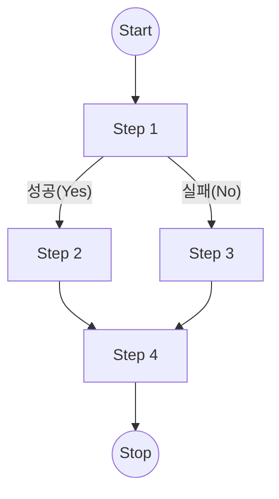

### Spring Batch: 조건별 흐름 제어 (Flow Job)
이 프로젝트는 Spring Batch의 Flow API를 사용하여, 이전 Step의 실행 결과(ExitStatus)에 따라 다음 실행할 Step을 동적으로 결정하는 방법을 보여주는 예제입니다.

#### 1. 프로젝트 개요
일반적인 배치 작업은 순차적(Step1 → Step2 → Step3)으로 진행되지만, 비즈니스 로직에 따라 **"성공 시 A 작업, 실패 시 B 작업"**과 같이 경로를 나눠야 할 때가 있습니다. 이 코드는 그 분기 처리를 구현했습니다.

#### 📋 주요 로직
Step 1 실행: 먼저 step1을 수행합니다.

조건 분기:

✅ 성공(COMPLETED) 시: step3로 이동합니다.

❌ 실패(FAILED) 시: step2로 이동합니다.

#### 2. 실행 흐름도 (Flow Diagram)
코드의 로직을 시각화하면 다음과 같습니다.

```graph TD
graph TD
    Start((Job 시작)) --> Step1[Step 1 실행]
    
    Step1 -- "성공 (COMPLETED)" --> Step3[Step 3 실행]
    Step1 -- "실패 (FAILED)" --> Step2[Step 2 실행]
    
    Step3 --> End((Job 종료))
    Step2 --> End
    
    %% 스타일링 (성공:초록, 실패:빨강, 기본:파랑)
    style Step1 fill:#e3f2fd,stroke:#1565c0,stroke-width:2px
    style Step3 fill:#e8f5e9,stroke:#2e7d32,stroke-width:2px
    style Step2 fill:#ffebee,stroke:#c62828,stroke-width:2px

```



#### 3. 코드 상세 분석 (FlowJobConfiguration.java)
JobBuilderFactory의 API를 사용하여 조건을 정의합니다.

```java
@Bean
public Job batchJob() {
    return this.jobBuilderFactory.get("batchJob")
        .start(step1())                // 1. step1 시작
        .on("COMPLETED").to(step3())   // 2. 결과가 COMPLETED라면 step3로 이동
        .from(step1())                 // 3. 다시 step1의 결과를 기준으로 (커서 복귀)
        .on("FAILED").to(step2())      // 4. 결과가 FAILED라면 step2로 이동
        .end()                         // 5. Flow 종료
        .build();
}
```

- `.on("STATUS")`: Step의 ExitStatus와 매칭되는 패턴을 정의합니다. (*을 사용해 전체 매칭도 가능)
- `.to(Step)`: 조건에 맞을 때 이동할 다음 단계입니다.

- `.from(Step)`: start() 이후에 연속으로 .on()을 사용할 수 없으므로, 다시 기준점이 되는 Step으로 시점을 되돌릴 때 사용합니다.
